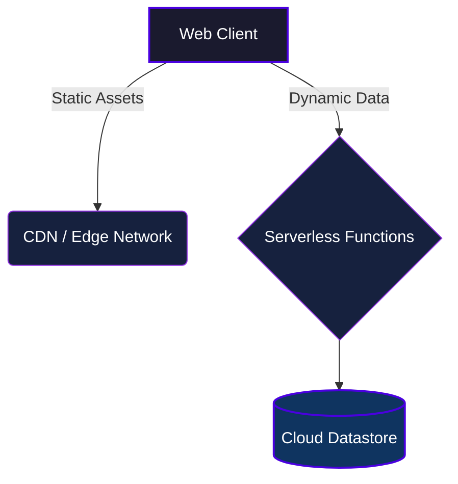

![Header](data:image/svg+xml;base64,PHN2ZyB3aWR0aD0iODAwIiBoZWlnaHQ9IjIwMCIgdmlld0JveD0iMCAwIDgwMCAyMDAiIHhtbG5zPSJodHRwOi8vd3d3LnczLm9yZy8yMDAwL3N2ZyI+CiAgPGRlZnM+CiAgICA8bGluZWFyR3JhZGllbnQgaWQ9ImdyYWQiIHgxPSIwJSIgeTE9IjAlIiB4Mj0iMTAwJSIgeTI9IjEwMCUiPgogICAgICA8c3RvcCBvZmZzZXQ9IjAlIiBzdG9wLWNvbG9yPSIjMGYyMDI3IiAvPgogICAgICA8c3RvcCBvZmZzZXQ9IjUwJSIgc3RvcC1jb2xvcj0iIzIwM2E0MyIgLz4KICAgICAgPHN0b3Agb2Zmc2V0PSIxMDAlIiBzdG9wLWNvbG9yPSIjMmM1MzY0IiAvPgogICAgPC9saW5lYXJHcmFkaWVudD4KICAgIDxmaWx0ZXIgaWQ9Imdsb3ciIHg9Ii0yMCUiIHk9Ii0yMCUiIHdpZHRoPSIxNDAlIiBoZWlnaHQ9IjE0MCUiPgogICAgICA8ZmVHYXVzc2lhbkJsdXIgc3RkRGV2aWF0aW9uPSI2IiByZXN1bHQ9ImJsdXIiIC8+CiAgICAgIDxmZUNvbXBvc2l0ZSBpbj0iU291cmNlR3JhcGhpYyIgaW4yPSJibHVyIiBvcGVyYXRvcj0ib3ZlciIgLz4KICAgIDwvZmlsdGVyPgogIDwvZGVmcz4KICA8cmVjdCB3aWR0aD0iMTAwJSIgaGVpZ2h0PSIxMDAlIiBmaWxsPSJ1cmwoI2dyYWQpIiByeD0iMTUiIHJ5PSIxNSIvPgogIAogIDx0ZXh0IHg9IjUwJSIgeT0iNDUlIiBmb250LWZhbWlseT0iQXJpYWwsIHNhbnMtc2VyaWYiIGZvbnQtd2VpZ2h0PSJib2xkIiBmb250LXNpemU9IjQ2IiBmaWxsPSIjMDBlNWZmIiB0ZXh0LWFuY2hvcj0ibWlkZGxlIiBmaWx0ZXI9InVybCgjZ2xvdykiIHN0eWxlPSJ0ZXh0LXRyYW5zZm9ybTogdXBwZXJjYXNlOyBsZXR0ZXItc3BhY2luZzogNXB4OyI+CiAgICBzeW5jIHdhdGNoCiAgPC90ZXh0PgogIAogIDx0ZXh0IHg9IjUwJSIgeT0iNzAlIiBmb250LWZhbWlseT0iQXJpYWwsIHNhbnMtc2VyaWYiIGZvbnQtc2l6ZT0iMTQiIGZpbGw9IiNmZmZmZmYiIHRleHQtYW5jaG9yPSJtaWRkbGUiIHN0eWxlPSJsZXR0ZXItc3BhY2luZzogM3B4OyBvcGFjaXR5OiAwLjg7Ij4KICAgIFBST1BSSUVUQVJZIEpBVkFTQ1JJUFQgVEVDSE5PTE9HWQogIDwvdGV4dD4KCiAgPCEtLSBBbmltYXRlZCBlbGVtZW50cyAtLT4KICA8Y2lyY2xlIGN4PSIxNTAiIGN5PSIxNTAiIHI9IjQiIGZpbGw9IiMwMGU1ZmYiIGZpbHRlcj0idXJsKCNnbG93KSI+CiAgICA8YW5pbWF0ZSBhdHRyaWJ1dGVOYW1lPSJjeCIgdmFsdWVzPSIxNTA7IDY1MDsgMTUwIiBkdXI9IjZzIiByZXBlYXRDb3VudD0iaW5kZWZpbml0ZSIgLz4KICA8L2NpcmNsZT4KICA8Y2lyY2xlIGN4PSI2NTAiIGN5PSI1MCIgcj0iMyIgZmlsbD0iIzAwZTVmZiIgZmlsdGVyPSJ1cmwoI2dsb3cpIj4KICAgIDxhbmltYXRlIGF0dHJpYnV0ZU5hbWU9ImN4IiB2YWx1ZXM9IjY1MDsgMTUwOyA2NTAiIGR1cj0iNnMiIHJlcGVhdENvdW50PSJpbmRlZmluaXRlIiAvPgogIDwvY2lyY2xlPgo8L3N2Zz4=)

 

  
  
  

*Exclusive Neural & Cognitive Architecture developed by Karthik Idikuda.*

---

## Technical Synopsis

> This project consists of 8 highly specialized modules written primarily in JavaScript.

Welcome to **sync watch**. This repository contains proprietary source code engineered by Karthik Idikuda. The architecture leverages deep integration techniques tailored specifically for this project's requirements, heavily optimized for execution efficiency.

 

## Internal System Engineering

The internal blueprint below dynamically represents the specific components and data execution flow identified within this repository.

 

## Proprietary Specifications

| Attribute | Implementation Detail |
|:---|:---|
| **Core Technology** | `JavaScript` |
| **System Scale** | `8 Identifiable Resource Nodes` |
| **Execution Tier** | `High-Performance / Latency Optimized` |
| **Intellectual Property** | `Strictly Confidential & Proprietary` |

 

## ⚠️ STRICT LEGAL WARNING & LICENSE

**PROPRIETARY AND CONFIDENTIAL**

This software and all associated documentation are the exclusive property of **Karthik Idikuda**. 

- **NO PERMISSION IS GRANTED** to use, copy, modify, merge, publish, distribute, sublicense, or sell copies of this software without explicit, written consent from the author.
- **UNAUTHORIZED USE WILL RESULT IN SEVERE LEGAL ACTION.** Any individual or organization found using, referencing, or deploying this code without paying the required licensing fees will face immediate litigation, financial penalties, and potentially criminal prosecution ("jail time") where applicable by law.
- **TO OBTAIN A LEGAL LICENSE**, you must directly contact Karthik Idikuda to negotiate payment terms.

*By viewing this repository, you agree to these strict proprietary terms.*

---

   
  

